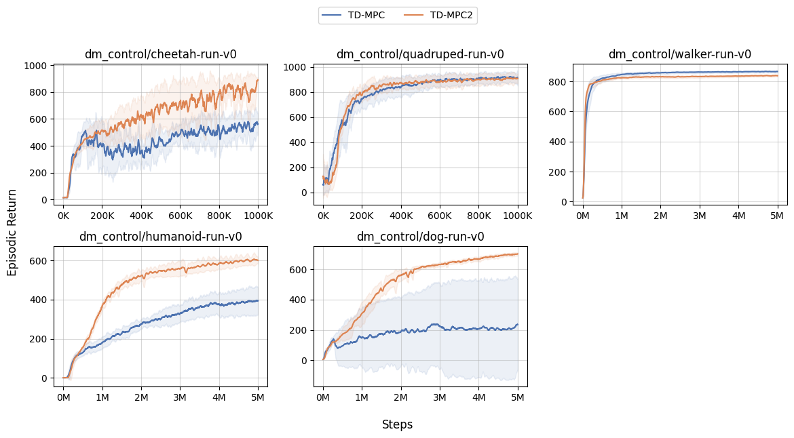
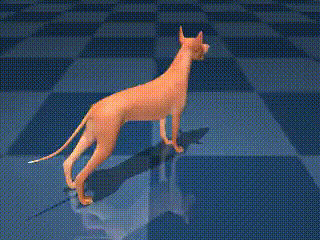
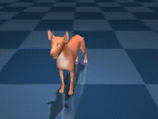

# Simple TD-MPCs (日本語版)

[JAX](https://github.com/google/jax)/[Flax](https://github.com/google/flax)による [TD-MPC](https://arxiv.org/abs/2203.04955) および [TD-MPC2](https://arxiv.org/abs/2310.16828) の実装です。

TD-MPC2 の公式実装が複数タスクの学習に対応しているのに対し、本実装はシンプルさに重点を置き、単一タスクの学習にのみ対応しています。

[CleanRL](https://github.com/vwxyzjn/cleanrl) に触発されて本実装では、アルゴリズムの処理を複数のファイルに分散させるのではなく、一つのファイル内でアルゴリズムの流れを追いやすいように設計し、可読性の向上を図っています。

## 実行結果
[DM-Control](https://github.com/google-deepmind/dm_control) 環境での学習テスト結果を以下に示します。

### 学習曲線

<div style="text-align: center">

</div>

### アニメーション 

* TD-MPCによる学習結果
<div style="text-align: center">
<figure>




</figure>
</div>

* TD-MPC2による学習結果
<div style="text-align: center">
<figure>




</figure>
</div>


## 環境設定
以下の手順に従って実行環境を設定します。

### Docker のセットアップ

```
# イメージのビルド
docker build -t simple_tdmpc .

# コンテナの起動
docker run \
    --gpus all \
    -it \
    --rm \
    -w $HOME/work \
    -v $(pwd):$HOME/work \
    simple_tdmpc:latest bash
```

### 依存ライブラリのインストール
[Poetry](https://python-poetry.org/docs/) を使用して依存ライブラリをインストールします。

```
poetry install
```

## 実行方法

### TD-MPC の実行

    ```
    poetry run python src/tdmpc.py 
    ```
### TD-MPC2 の実行

    ```
    poetry run python src/tdmpc2.py 
    ```

## オプション

* `--capture_video` オプションを付与すると、学習プロセス中のビデオを `/videos` フォルダに保存できます。

    ```
    poetry run python src/tdmpc2.py --capture_video
    ```

*  `--track` オプションを付与すると、wandb を介して実験ログを記録できます。

    ```
    poetry run wandb login
    poetry run python src/tdmpc2.py --track --capture_video
    ```
    > 二行目で `transport faild error` が出る場合は、エラー文に出力される ```git config``` コマンドを実行して下さい。

*  `--task` オプションで学習するタスクを切り替えることができます。

    ```
    poetry run python src/tdmpc2.py --task 'dm_control/quadruped-run-v0' --total_timesteps 1000000
    ```


## 参考にしたリポジトリ

- [TD-MPC](https://github.com/nicklashansen/tdmpc)
- [TD-MPC2](https://github.com/nicklashansen/tdmpc2)
- [CleanRL (Clean Implementation of RL Algorithms)](https://github.com/vwxyzjn/cleanrl)